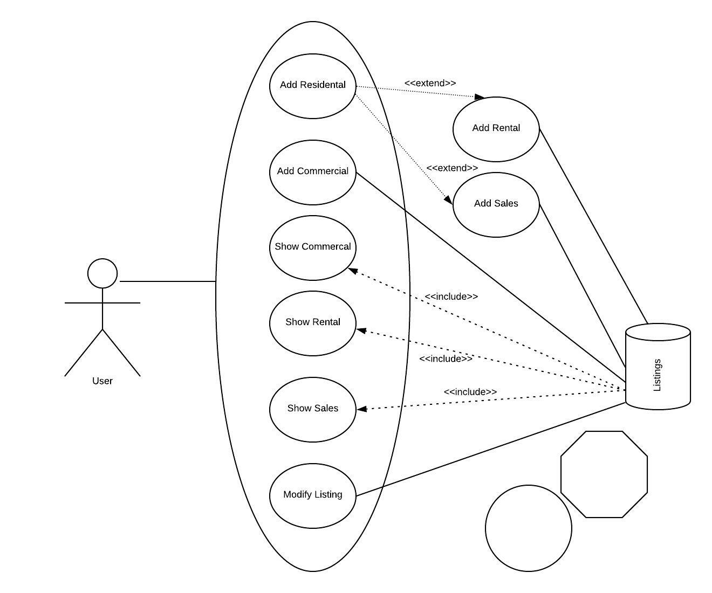

## The Application

DBS Property Venture is a Windows Console application used to give users access to listings of properties held by DBS. Users can view, modify and create several properties of the following types:  

*Commercial Build*

*Rental*

*Sales*

This app is intended to one day be hooked up to a database on the back end and a UI for the web on the front end. The Windows App itself would also be intended to be developed further to be used on Windows machines.  

## Use Case Diagram

## Class Diagram

## Technical Merit

**IDs & Enum Listing Type:**
I added IDs to the instances when they were being created. This helped to identify the current listing that was being “modified” but it was in fact just storing the id of one we were deleting, to add it back. I also thought IDs would be useful in other areas when scaling the app. They could be saved to a database or processed on the database layer. I also added a new Enum to filter the list, so that I didn’t have to create separate lists for different types of properties and could use logic to return the property by class type. 
 

**Sale Status:**
I made it so that a new sale property being added was ‘For Sale’ by default and could only be changed when modifying. It wouldn’t make sense for the user to have to list a Sold property, but they can modify an existing listing to be marked as Sold or Sale agreed.  
 

**Format Address:**
I was able to format the address onto new lines in the background, so that the user didn’t have to do that in the UI which would make it tedious to use. So instead, I split it up by asking the user for commas and replacing them with regex. This just mimics better UI in the console with less lift for the user.  
 

**Application class:**
I used an Application class instead of bundling all my UI logic in the program.cs. I decided to use this implementation of my app starting in its own class as I've always been curious that the main method shouldn't contain all my console logic, and my program.cs was getting quite long.  

I tried to think of this in terms of a real world, saleable app and after some research online it felt intuitive to create a class for the application 'dashboard' itself, having the property classes and lists off to the side, and reserve the main method here as solely an entry point for starting the app and some config that could be added down the line as it grew.   

After some reading, I found some references that backed up my approach and idea for the try cath snippet in program.cs:  

https://en.wikipedia.org/wiki/Single-responsibility_principle 

https://www.reddit.com/r/csharp/comments/fvb88y/what_should_actually_be_inside_the_main_method_of/ 

## Test Plan

**Successful Error handling:**

   For these operations you shouldn’t be able to enter incorrect data types or options
   If you select N when prompted to confirm any details you should be able to re-enter 

**Show properties:**

        On start – option 3 no commercials exist 

        On start – option 4 no rentals exist  

        On start – option 5 the default sales data exists 
 

**Adding properties:**
 
        Commercial added successfully - after returning to main menu use option 3 to see it exists 

        Rental added successfully - after returning to main menu use option 4 to see it exists 

        Sales added successfully - after returning to main menu use option 5 to see it exists 

           
**Try Modify something that doesn’t exist**

        Enter the wrong id it won't work 

        To fully test, make sure there are 2 properties of different type existing and try one of the IDs after selecting a different property type to modify – it shouldn’t work 

 
**Modify one of the existing sales listings:**

        First list all Sales properties 

        Record ID of one you want to modify 

        Modify property with that ID - you can use upper or lower 

        Re list all Sale Properties to see the change 

 

**Modify a property after you added it:**

        First add a property 

        List the property type to Record the ID of one you just added 

        Modify property with that ID - you can use upper or lower 

        Re list the property type you added to see the change 

 

 

